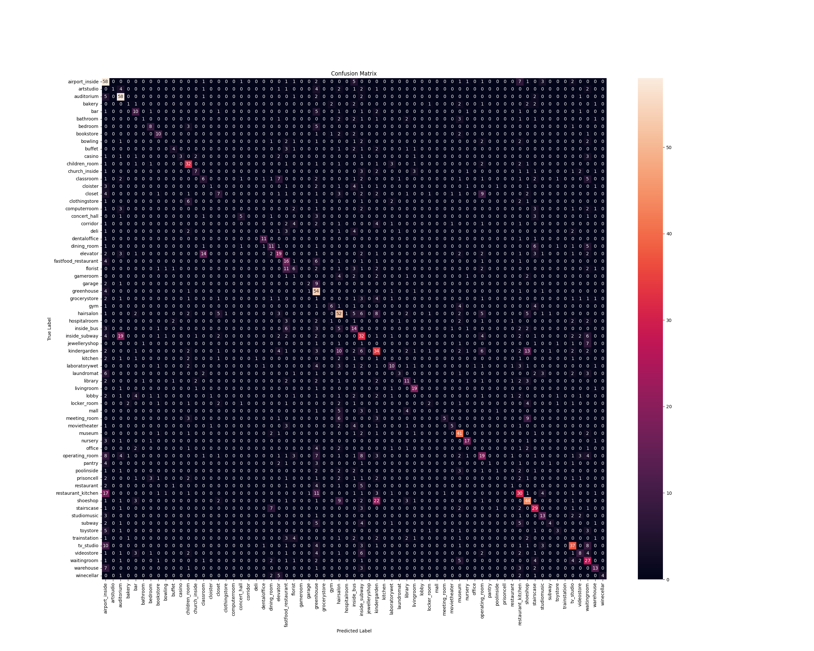
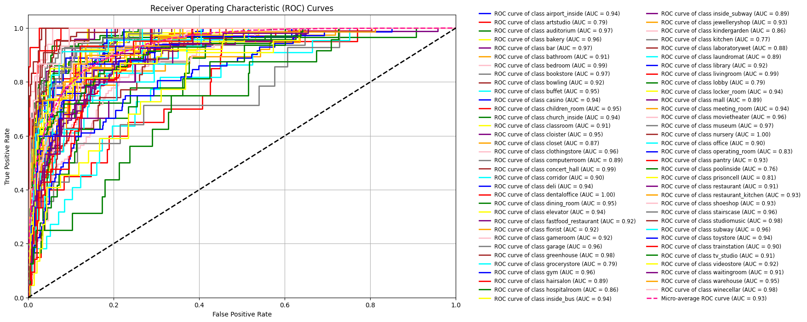
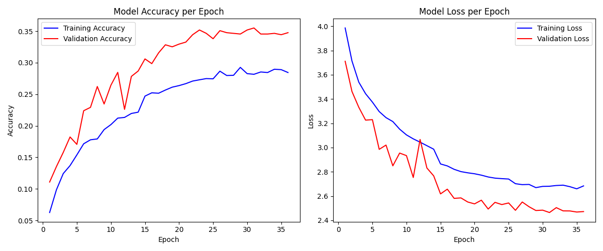
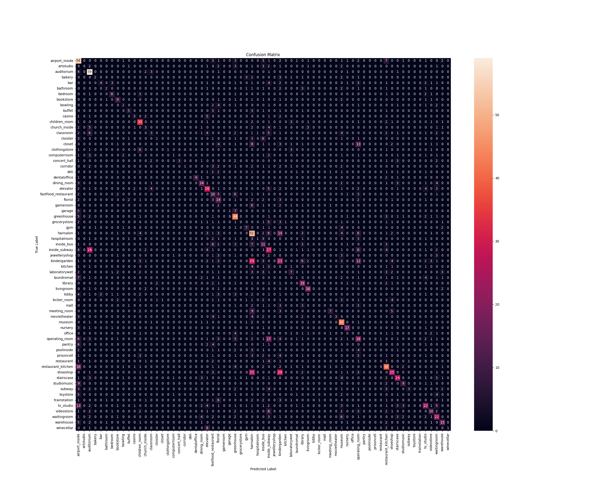
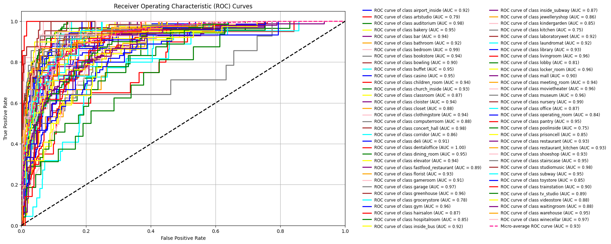
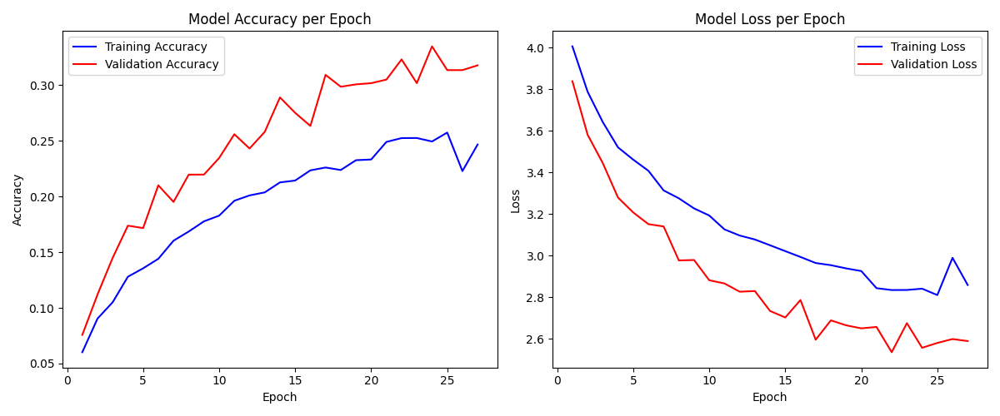

# CNNPruning_Classifier

This repository provides tools for training, pruning, and evaluating Convolutional Neural Networks (CNNs) for image classification tasks.
The dataset used in this project can be found here: [Indoor Scenes CVPR 2019](https://www.kaggle.com/datasets/itsahmad/indoor-scenes-cvpr-2019)

## Table of Contents

- [Overview](#overview)
- [Repository Structure](#repository-structure)
- [Installation](#installation)
- [Usage](#usage)
  - [Data Preprocessing](#data-preprocessing)
  - [Model Training](#model-training)
  - [Model Evaluation](#model-evaluation)
  - [Image Classification](#image-classification)
- [Model Evaluation Results](#model-evaluation-results)
  - [Without Pruning](#without-pruning)
  - [With Pruning](#with-pruning)
  - [Comparative Analysis](#comparative-analysis)
- [Contributing](#contributing)
- [License](#license)

## Overview

CNNPruning_Classifier offers functionalities to:

- Preprocess image datasets.
- Train CNN models.
- Prune trained models to optimize performance.
- Evaluate model accuracy and efficiency.
- Classify new images using trained models.

## Repository Structure

- `eval/`: Directory containing evaluation scripts and results.
- `model/`: Directory containing model architectures and weights.
- `.gitattributes`: Git attributes configuration file.
- `.gitignore`: Specifies files and directories to be ignored by Git.
- `classify_image.py`: Script to classify new images using a trained model.
- `evaluate.py`: Script to evaluate the performance of a trained model.
- `preprocess.py`: Script for preprocessing image datasets.
- `requirements.txt`: Lists the Python dependencies required for this project.
- `train.py`: Script to train the CNN model.

## Installation

1. **Clone the repository:**

   ```bash
   git clone https://github.com/SoudeepGhoshal/CNNPruning_Classifier.git
   ```

2. **Navigate to the project directory:**

   ```bash
   cd CNNPruning_Classifier
   ```

3. **Install the required dependencies:**

   ```bash
   pip install -r requirements.txt
   ```

## Usage

### Data Preprocessing

Use the `preprocess.py` script to prepare your image dataset for training.

```bash
python preprocess.py
```

### Model Training

Train the CNN model using the `train.py` script.

```bash
python train.py
```

### Model Evaluation

Evaluate the performance of your trained model using the `evaluate.py` script.

```bash
python evaluate.py
```

### Image Classification

Classify new images using the trained model with the `classify_image.py` script.

```bash
python classify_image.py --model_dir path/to/saved_model --image_path path/to/image.jpg
```

## Model Evaluation Results

This section presents a comparative analysis of the model's performance with and without pruning. The evaluations include classification reports, confusion matrices, ROC curves, and training history plots.

### Without Pruning

**Classification Report:**

| Class                 | Precision | Recall | F1-Score | Support |
|-----------------------|-----------|--------|----------|---------|
| airport_inside       | 0.31      | 0.68   | 0.42     | 85      |
| artstudio            | 1.00      | 0.05   | 0.10     | 20      |
| auditorium           | 0.53      | 0.81   | 0.64     | 72      |
| bakery               | 0.20      | 0.07   | 0.10     | 15      |
| bar                  | 0.32      | 0.40   | 0.36     | 25      |
| bathroom             | 0.33      | 0.06   | 0.11     | 16      |
| bedroom              | 0.50      | 0.47   | 0.48     | 17      |
| bookstore            | 0.48      | 0.53   | 0.50     | 19      |
| bowling              | 0.00      | 0.00   | 0.00     | 15      |
| buffet               | 0.44      | 0.25   | 0.32     | 16      |
| casino               | 1.00      | 0.20   | 0.33     | 15      |
| children_room        | 0.48      | 0.67   | 0.56     | 48      |
| church_inside        | 0.54      | 0.29   | 0.38     | 24      |
| classroom            | 0.21      | 0.17   | 0.18     | 36      |
| cloister             | 0.33      | 0.06   | 0.10     | 18      |
| closet               | 0.30      | 0.18   | 0.23     | 38      |
| clothingstore        | 0.00      | 0.00   | 0.00     | 14      |
| computerroom         | 0.00      | 0.00   | 0.00     | 16      |
| concert_hall         | 0.56      | 0.33   | 0.42     | 15      |
| corridor             | 0.00      | 0.00   | 0.00     | 18      |
| deli                 | 0.00      | 0.00   | 0.00     | 15      |
| dentaloffice         | 0.73      | 0.79   | 0.76     | 14      |
| dining_room          | 0.37      | 0.37   | 0.37     | 30      |
| elevator             | 0.36      | 0.33   | 0.35     | 57      |
| fastfood_restaurant  | 0.22      | 0.50   | 0.31     | 32      |
| florist              | 0.21      | 0.18   | 0.19     | 34      |
| gameroom             | 0.00      | 0.00   | 0.00     | 14      |
| garage               | 0.50      | 0.14   | 0.22     | 14      |
| greenhouse           | 0.30      | 0.84   | 0.44     | 64      |
| grocerystore         | 0.00      | 0.00   | 0.00     | 22      |
| gym                  | 0.60      | 0.33   | 0.43     | 18      |
| hairsalon            | 0.40      | 0.50   | 0.44     | 103     |
| hospitalroom         | 0.00      | 0.00   | 0.00     | 18      |
| inside_bus           | 0.20      | 0.37   | 0.26     | 38      |
| inside_subway        | 0.27      | 0.38   | 0.32     | 85      |
| jewelleryshop        | 0.00      | 0.00   | 0.00     | 15      |
| kindergarden         | 0.30      | 0.34   | 0.32     | 99      |
| kitchen              | 0.00      | 0.00   | 0.00     | 14      |
| laboratorywet        | 0.42      | 0.29   | 0.34     | 35      |
| laundromat           | 0.50      | 0.12   | 0.20     | 24      |
| library              | 0.34      | 0.33   | 0.34     | 33      |
| livingroom           | 0.59      | 0.79   | 0.68     | 24      |
| lobby                | 0.00      | 0.00   | 0.00     | 24      |
| locker_room          | 0.29      | 0.10   | 0.15     | 20      |
| mall                 | 0.00      | 0.00   | 0.00     | 15      |
| meeting_room         | 0.83      | 0.19   | 0.30     | 27      |
| movietheater         | 0.62      | 0.26   | 0.37     | 19      |
| museum               | 0.51      | 0.76   | 0.61     | 54      |
| nursery              | 0.65      | 0.71   | 0.68     | 24      |
| office               | 0.00      | 0.00   | 0.00     | 15      |
| operating_room       | 0.29      | 0.26   | 0.28     | 72      |
| pantry               | 1.00      | 0.07   | 0.12     | 15      |
| poolinside           | 0.25      | 0.06   | 0.10     | 16      |
| prisoncell           | 0.00      | 0.00   | 0.00     | 22      |
| restaurant           | 0.17      | 0.07   | 0.10     | 15      |
| restaurant_kitchen   | 0.34      | 0.39   | 0.36     | 76      |
| shoeshop             | 0.44      | 0.48   | 0.46     | 92      |
| stairscase           | 0.40      | 0.60   | 0.48     | 48      |
| studiomusic          | 0.45      | 0.59   | 0.51     | 22      |
| subway               | 0.57      | 0.17   | 0.27     | 23      |
| toystore             | 0.38      | 0.20   | 0.26     | 15      |
| trainstation         | 0.00      | 0.00   | 0.00     | 21      |
| tv_studio            | 0.52      | 0.52   | 0.52     | 71      |
| videostore           | 0.33      | 0.21   | 0.26     | 38      |
| waitingroom          | 0.28      | 0.51   | 0.36     | 53      |
| warehouse            | 0.50      | 0.43   | 0.46     | 30      |
| winecellar           | 1.00      | 0.27   | 0.42     | 15      |
| **Accuracy**         | **—**     | **—**  | **0.37** | **2186** |
| **Macro Avg**        | 0.35      | 0.28   | 0.27     | 2186    |
| **Weighted Avg**     | 0.36      | 0.37   | 0.33     | 2186    |


**Confusion Matrix:**



**ROC Curves:**



**Training History:**



### With Pruning

**Classification Report:**

| Class                | Precision | Recall | F1-Score | Support |
|----------------------|-----------|--------|----------|---------|
| airport_inside      | 0.28      | 0.64   | 0.39     | 85      |
| artstudio          | 0.00      | 0.00   | 0.00     | 20      |
| auditorium         | 0.44      | 0.82   | 0.57     | 72      |
| bakery            | 0.67      | 0.13   | 0.22     | 15      |
| bar               | 0.57      | 0.16   | 0.25     | 25      |
| bathroom          | 0.40      | 0.12   | 0.19     | 16      |
| bedroom           | 0.53      | 0.47   | 0.50     | 17      |
| bookstore         | 0.38      | 0.47   | 0.42     | 19      |
| bowling           | 0.25      | 0.13   | 0.17     | 15      |
| buffet            | 0.45      | 0.31   | 0.37     | 16      |
| casino            | 0.38      | 0.20   | 0.26     | 15      |
| children_room     | 0.48      | 0.69   | 0.56     | 48      |
| church_inside     | 0.21      | 0.12   | 0.16     | 24      |
| classroom         | 0.21      | 0.08   | 0.12     | 36      |
| cloister          | 0.25      | 0.06   | 0.09     | 18      |
| closet            | 0.00      | 0.00   | 0.00     | 38      |
| clothingstore     | 1.00      | 0.07   | 0.13     | 14      |
| computerroom      | 0.25      | 0.06   | 0.10     | 16      |
| concert_hall      | 1.00      | 0.20   | 0.33     | 15      |
| corridor          | 1.00      | 0.06   | 0.11     | 18      |
| deli              | 0.00      | 0.00   | 0.00     | 15      |
| dentaloffice      | 1.00      | 0.64   | 0.78     | 14      |
| dining_room       | 0.42      | 0.47   | 0.44     | 30      |
| elevator          | 0.38      | 0.49   | 0.43     | 57      |
| fastfood_restaurant | 0.15    | 0.31   | 0.21     | 32      |
| florist           | 0.19      | 0.41   | 0.26     | 34      |
| gameroom          | 0.00      | 0.00   | 0.00     | 14      |
| garage            | 1.00      | 0.07   | 0.13     | 14      |
| greenhouse        | 0.38      | 0.69   | 0.49     | 64      |
| grocerystore      | 0.00      | 0.00   | 0.00     | 22      |
| gym               | 0.47      | 0.39   | 0.42     | 18      |
| hairsalon         | 0.26      | 0.50   | 0.34     | 103     |
| hospitalroom      | 0.50      | 0.06   | 0.10     | 18      |
| inside_bus        | 0.17      | 0.29   | 0.21     | 38      |
| inside_subway     | 0.23      | 0.32   | 0.26     | 85      |
| jewelleryshop     | 0.00      | 0.00   | 0.00     | 15      |
| kindergarden      | 0.19      | 0.23   | 0.21     | 99      |
| kitchen           | 0.00      | 0.00   | 0.00     | 14      |
| laboratorywet     | 0.32      | 0.20   | 0.25     | 35      |
| laundromat        | 0.14      | 0.04   | 0.06     | 24      |
| library           | 0.36      | 0.58   | 0.44     | 33      |
| livingroom        | 0.60      | 0.75   | 0.67     | 24      |
| lobby             | 0.00      | 0.00   | 0.00     | 24      |
| locker_room       | 0.00      | 0.00   | 0.00     | 20      |
| mall              | 0.00      | 0.00   | 0.00     | 15      |
| meeting_room      | 0.64      | 0.26   | 0.37     | 27      |
| movietheater      | 1.00      | 0.16   | 0.27     | 19      |
| museum            | 0.39      | 0.78   | 0.52     | 54      |
| nursery           | 0.63      | 0.71   | 0.67     | 24      |
| office            | 0.00      | 0.00   | 0.00     | 15      |
| operating_room    | 0.17      | 0.25   | 0.20     | 72      |
| pantry            | 0.00      | 0.00   | 0.00     | 15      |
| poolinside        | 0.00      | 0.00   | 0.00     | 16      |
| prisoncell        | 0.00      | 0.00   | 0.00     | 22      |
| restaurant        | 0.00      | 0.00   | 0.00     | 15      |
| restaurant_kitchen | 0.41     | 0.53   | 0.46     | 76      |
| shoeshop          | 0.49      | 0.27   | 0.35     | 92      |
| stairscase        | 0.48      | 0.50   | 0.49     | 48      |
| studiomusic       | 0.50      | 0.41   | 0.45     | 22      |
| subway            | 0.75      | 0.13   | 0.22     | 23      |
| toystore          | 0.00      | 0.00   | 0.00     | 15      |
| trainstation      | 0.00      | 0.00   | 0.00     | 21      |
| tv_studio         | 0.36      | 0.31   | 0.33     | 71      |
| videostore        | 0.36      | 0.26   | 0.30     | 38      |
| waitingroom       | 0.33      | 0.42   | 0.37     | 53      |
| warehouse         | 0.45      | 0.50   | 0.48     | 30      |
| winecellar        | 1.00      | 0.07   | 0.12     | 15      |
| **Accuracy**      | **0.34**  |        |          | 2186    |
| **Macro Avg**     | 0.35      | 0.25   | 0.24     | 2186    |
| **Weighted Avg**  | 0.34      | 0.34   | 0.30     | 2186    |


**Confusion Matrix:**



**ROC Curves:**



**Training History:**



### Comparative Analysis

By comparing the above metrics and plots, one can assess the impact of pruning on the model's performance. Key aspects to consider include changes in accuracy, precision, recall, and the area under the ROC curve. Additionally, evaluating the training history plots can provide insights into the convergence behavior and training efficiency with and without pruning.

## Contributing

Contributions are welcome! Please fork this repository and submit a pull request with your improvements.

## License

This project is licensed under the MIT License. See the `LICENSE` file for details.
